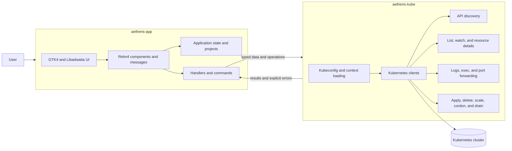

Aetheris started from a very direct need: I wanted a more natural way to work with Kubernetes clusters on the desktop.

I use the terminal every day, and I like it. But not everything gets better when it becomes a chain of commands, pipes, aliases, and context switches. Many times I just want to open a cluster, understand the state of the resources, inspect logs, edit YAML, open a shell inside a pod, and keep working without jumping between tools all the time.

The idea was to build a native Kubernetes client with a GNOME feel, written in Rust, using GTK4, Libadwaita, Relm4, and kube-rs. I did not want a web dashboard wrapped inside a window. I wanted a real desktop application.

## The Problem I Wanted To Solve

Kubernetes is powerful, but the daily workflow can become fragmented. You move between `kubectl get`, `kubectl describe`, `kubectl logs`, `kubectl exec`, YAML editors, port forwarding, documentation, and depending on the environment, OpenShift may also be part of the flow.

Aetheris tries to organize that workflow into one interface:

- explicit project and cluster organization;
- a resource browser for cluster objects;
- detail views with overview, YAML, events, conditions, and related objects;
- real-time logs with ANSI colors;
- interactive terminals inside containers;
- operations like apply, delete, scale, cordon, drain, and port forwarding.

The goal was not to hide Kubernetes. It was to make Kubernetes easier to operate day to day without taking control away from the person using it.

## Why Native

I could have taken the more common path: a web application, maybe packaged with Electron or Tauri. But Aetheris is part of the broader LuminusOS context, and I wanted it to feel like a first-class Linux desktop application.

GTK4 and Libadwaita were natural choices because of their GNOME integration, adaptive widgets, and consistent visual language. Relm4 helped structure the application around components and messages instead of turning the UI into a large block of callbacks.

Rust also fit the problem well. The app has to deal with networking, streams, async tasks, UI state, RBAC errors, kubeconfig parsing, and operations that may stay open for a long time. Strong types, clear ownership, and an ecosystem like kube-rs made a real difference.

## A Two-Part Architecture

From the beginning, I tried to keep a clear boundary between Kubernetes behavior and graphical interface behavior. The project is split into two crates:

- `aetheris-kube`: the pure Kubernetes backend;
- `aetheris-app`: the GTK/Relm4 application.

This separation sounds simple, but it prevents a lot of technical debt. The `aetheris-kube` crate does not know about GTK, Libadwaita, Relm4, VTE, or widgets. It owns kubeconfig parsing, clients, discovery, list and watch behavior, logs, exec, port forwarding, metrics, resource details, and mutations.

The `aetheris-app` crate owns windows, layout, application state, project persistence, handlers, commands, and widgets. The two sides communicate through data types exported by the backend.

In practice, this boundary gave me room to evolve the UI without contaminating the Kubernetes logic, and to change backend behavior without thinking about buttons, pages, or visual components.

## The Application Flow

When Aetheris starts, it loads the kubeconfig, discovers contexts and namespaces, reads the local project state, and opens on the projects page. Projects are stored in `~/.config/aetheris/projects.json`.

I made an important decision here: contexts created outside Aetheris, through `kubectl` or `oc`, are not automatically added to a project. The app can read the kubeconfig, but project organization is an explicit user choice. That prevents personal clusters, production, staging, and temporary environments from appearing mixed together without intent.

When a project is selected, the application shows only the clusters assigned to that project. When a cluster is opened, the backend connects to the selected context, lists namespaces, discovers available resources, and loads the data needed for navigation.

## Snapshot First, Watch After

One important part of Aetheris is object listing. I did not want an interface that stayed blank while waiting for an infinite stream to start producing events.

The flow became: first the app loads a snapshot of the objects so the list can render quickly. Then it opens a watcher through kube-rs to keep that view updated with applied, deleted, restarted, or error events.

This makes the interface more responsive and more predictable. The user sees something quickly, and cluster changes arrive after that.

Another detail was building rows in chunks. In large clusters, rendering a huge list at once can block the GTK main loop. Doing it in batches keeps the interface alive even when the cluster has many resources.

## Details, YAML, And Operations

The detail screen concentrates a large part of the application work. Depending on the resource, it can show an overview, YAML, events, conditions, related pods, logs, containers, and metrics.

For YAML editing, I used GtkSourceView. The goal was to provide an experience closer to a real editor, with syntax highlighting and enough space to review the manifest before applying it. Apply goes through the backend and uses server-side apply instead of just pushing raw text blindly.

Operations follow the same rule: the UI sends an intention, the backend runs it with kube-rs, and the result comes back as data or an explicit error. Delete, scale, cordon, drain, and port forwarding are not scattered across the interface. They go through the layer that understands Kubernetes.

This matters because Kubernetes errors are rarely generic. They may come from RBAC, missing resources, wrong namespaces, unavailable APIs, missing metrics-server, or operations that are only partially supported in that cluster. I tried to make the app fail in a useful way, especially when the response is `Forbidden`.

## Logs And Terminal

Real-time logs were a fun part to implement because they look simple from the outside, but they need to respect cancellation, context changes, ANSI colors, and follow mode.

The terminal inside pods was another interesting area. On Linux, Aetheris uses VTE to provide a real terminal inside the window. User input goes to stdin for Kubernetes exec, and output comes back into the terminal. When the cluster denies `pods/exec`, the window shows a permission error instead of staying blank.

This kind of detail changes how the application feels. When a long operation gets stuck without feedback, it looks like a bug. When it shows exactly what happened, the user can understand whether the issue is in the app, the cluster, or the permissions.

## Cancellation And Long-Running Tasks

A desktop Kubernetes client is surrounded by long-running tasks: watches, logs, terminals, port forwarding, and detail loading. If those tasks are not cancellable, the application starts accumulating old work and showing results out of context.

That is why long operations use abort handles. Switching clusters, closing a window, or changing a detail view has to stop work that no longer makes sense. This was one of the decisions that helped the most with keeping behavior predictable.

Relm4's message model helps here too. The UI does not call everything directly. It sends messages, async commands do work outside the interface, and results return as new messages. That makes the flow easier to trace.

## Packaging Is Part Of The Product

Building the app was only one part of the work. I also wanted it to be distributed in different formats: Flatpak, AppImage, macOS, Windows portable, and a Windows installer.

The Flatpak build uses the manifest in `build-aux/org.luminusos.Aetheris.json`. The AppImage reads metadata from the `aetheris-app` `Cargo.toml`. macOS uses `cargo-bundle`, GTK runtime libraries from Homebrew, and `create-dmg`. Windows uses MSYS2/CLANG64 and Inno Setup.

Not everything is symmetrical across platforms. A concrete example is VTE: on Windows, current bundles are compiled without pod terminals because the GTK4 VTE library is not available in the MSYS2/MinGW package set used by CI. Instead of forcing a fragile workaround, I treated that as a build limitation.

## What I Learned

Aetheris reinforced something I already value a lot: good architecture is not about having many layers. It is about putting each responsibility in the right place.

Separating `aetheris-kube` from `aetheris-app` made the project easier to understand. Using kube-rs instead of shelling out to `kubectl` kept the app more typed and predictable. Respecting GNOME HIG and Libadwaita prevented the interface from becoming a collection of random visual decisions. Treating RBAC, cancellation, and errors as core parts of the product made the app more reliable.

There is still a lot I want to evolve, but Aetheris already represents the kind of software I like to build: technical, native, direct, and designed for real use.

In the end, it does not try to replace the terminal. It tries to reduce the friction between the developer and the cluster. For me, that is the right place for it.
