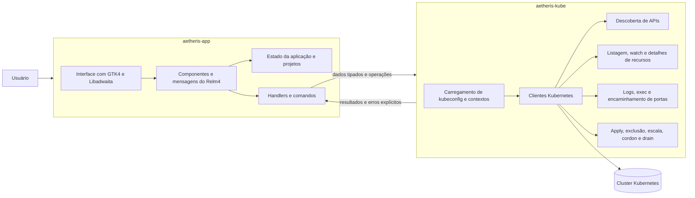

O Aetheris nasceu de uma necessidade muito direta: eu queria uma maneira mais natural de trabalhar com clusters Kubernetes no desktop.

Uso o terminal todos os dias e gosto dele. Mas nem tudo fica melhor quando se transforma em uma sequência de comandos, pipes, aliases e trocas de contexto. Muitas vezes, quero apenas abrir um cluster, entender o estado dos recursos, inspecionar logs, editar YAML, abrir um shell dentro de um pod e continuar trabalhando sem alternar entre ferramentas o tempo todo.

A ideia era criar um cliente Kubernetes nativo com a identidade do GNOME, escrito em Rust e usando GTK4, Libadwaita, Relm4 e kube-rs. Eu não queria um painel web encapsulado em uma janela. Queria uma aplicação desktop de verdade.

## O problema que eu queria resolver

O Kubernetes é poderoso, mas o fluxo de trabalho diário pode se tornar fragmentado. Você alterna entre `kubectl get`, `kubectl describe`, `kubectl logs`, `kubectl exec`, editores de YAML, encaminhamento de portas e documentação. Dependendo do ambiente, o OpenShift também pode fazer parte desse fluxo.

O Aetheris busca organizar esse trabalho em uma única interface:

- organização explícita de projetos e clusters;
- um navegador para os recursos do cluster;
- visualizações detalhadas com visão geral, YAML, eventos, condições e objetos relacionados;
- logs em tempo real com cores ANSI;
- terminais interativos dentro de contêineres;
- operações como apply, exclusão, escalonamento, cordon, drain e encaminhamento de portas.

O objetivo não era esconder o Kubernetes. Era facilitar sua operação no dia a dia sem retirar o controle de quem utiliza a ferramenta.

## Por que uma aplicação nativa

Eu poderia ter seguido o caminho mais comum: uma aplicação web, talvez empacotada com Electron ou Tauri. Mas o Aetheris faz parte do contexto mais amplo do LuminusOS, e eu queria que ele tivesse a experiência de uma aplicação Linux de primeira classe.

GTK4 e Libadwaita foram escolhas naturais por sua integração com o GNOME, seus widgets adaptativos e sua linguagem visual consistente. O Relm4 ajudou a estruturar a aplicação em torno de componentes e mensagens, evitando que a interface se transformasse em um grande bloco de callbacks.

Rust também se encaixou muito bem no problema. A aplicação precisa lidar com rede, streams, tarefas assíncronas, estado da interface, erros de RBAC, leitura de kubeconfig e operações que podem permanecer abertas por muito tempo. Tipos fortes, ownership claro e um ecossistema como o kube-rs fizeram uma diferença real.

## Uma arquitetura dividida em duas partes

Desde o início, procurei manter uma separação clara entre o comportamento relacionado ao Kubernetes e o comportamento da interface gráfica. O projeto é dividido em dois crates:

- `aetheris-kube`: o back-end Kubernetes puro;
- `aetheris-app`: a aplicação GTK/Relm4.

Essa separação parece simples, mas evita muito débito técnico. O crate `aetheris-kube` não conhece GTK, Libadwaita, Relm4, VTE ou widgets. Ele é responsável pela leitura do kubeconfig, clientes, descoberta, comportamento de listagem e watch, logs, exec, encaminhamento de portas, métricas, detalhes de recursos e mutações.

O crate `aetheris-app` é responsável por janelas, layout, estado da aplicação, persistência de projetos, handlers, comandos e widgets. Os dois lados se comunicam por meio de tipos de dados exportados pelo back-end.

Na prática, essa divisão me deu liberdade para evoluir a interface sem contaminar a lógica do Kubernetes e para alterar o comportamento do back-end sem precisar pensar em botões, páginas ou componentes visuais.

## O fluxo da aplicação

Quando o Aetheris inicia, ele carrega o kubeconfig, descobre contextos e namespaces, lê o estado local dos projetos e abre a página de projetos. Os projetos são armazenados em `~/.config/aetheris/projects.json`.

Tomei uma decisão importante nesse ponto: contextos criados fora do Aetheris, por meio de `kubectl` ou `oc`, não são adicionados automaticamente a um projeto. A aplicação consegue ler o kubeconfig, mas a organização dos projetos é uma escolha explícita do usuário. Isso evita que clusters pessoais, de produção, de homologação e ambientes temporários apareçam misturados sem intenção.

Quando um projeto é selecionado, a aplicação exibe apenas os clusters atribuídos a ele. Ao abrir um cluster, o back-end se conecta ao contexto selecionado, lista os namespaces, descobre os recursos disponíveis e carrega os dados necessários para a navegação.

## Primeiro o snapshot, depois o watch

Uma parte importante do Aetheris é a listagem de objetos. Eu não queria uma interface vazia enquanto aguardava um stream infinito começar a produzir eventos.

O fluxo ficou assim: primeiro, a aplicação carrega um snapshot dos objetos para renderizar a lista rapidamente. Em seguida, abre um watcher por meio do kube-rs para manter a visualização atualizada com eventos de aplicação, exclusão, reinicialização ou erro.

Isso torna a interface mais responsiva e previsível. O usuário visualiza informações rapidamente, e as mudanças do cluster chegam logo depois.

Outro detalhe foi a criação das linhas em lotes. Em clusters grandes, renderizar uma lista enorme de uma só vez pode bloquear o loop principal do GTK. Processar os itens em grupos mantém a interface responsiva mesmo quando o cluster possui muitos recursos.

## Detalhes, YAML e operações

A tela de detalhes concentra grande parte do trabalho da aplicação. Dependendo do recurso, ela pode exibir uma visão geral, YAML, eventos, condições, pods relacionados, logs, contêineres e métricas.

Para a edição de YAML, usei GtkSourceView. O objetivo era oferecer uma experiência próxima à de um editor real, com destaque de sintaxe e espaço suficiente para revisar o manifesto antes de aplicá-lo. O apply passa pelo back-end e usa server-side apply em vez de simplesmente enviar texto bruto sem validação.

As operações seguem a mesma regra: a interface envia uma intenção, o back-end a executa com kube-rs e o resultado retorna como dados ou como um erro explícito. Exclusão, escala, cordon, drain e encaminhamento de portas não ficam espalhados pela interface. Todas essas ações passam pela camada que entende Kubernetes.

Isso é importante porque erros do Kubernetes raramente são genéricos. Eles podem ser causados por RBAC, recursos ausentes, namespaces incorretos, APIs indisponíveis, ausência do metrics-server ou operações parcialmente suportadas naquele cluster. Procurei fazer com que a aplicação falhasse de maneira útil, especialmente quando a resposta é `Forbidden`.

## Logs e terminal

Os logs em tempo real foram uma parte divertida de implementar porque parecem simples por fora, mas precisam respeitar cancelamento, mudanças de contexto, cores ANSI e o modo follow.

O terminal dentro dos pods foi outra área interessante. No Linux, o Aetheris usa VTE para oferecer um terminal real dentro da janela. A entrada do usuário é enviada ao stdin do exec do Kubernetes, e a saída retorna ao terminal. Quando o cluster nega `pods/exec`, a janela exibe um erro de permissão em vez de permanecer vazia.

Esse tipo de detalhe muda a percepção da aplicação. Quando uma operação longa trava sem fornecer feedback, parece um bug. Quando ela mostra exatamente o que aconteceu, o usuário consegue entender se o problema está na aplicação, no cluster ou nas permissões.

## Cancelamento e tarefas de longa duração

Um cliente Kubernetes para desktop é cercado por tarefas de longa duração: watches, logs, terminais, encaminhamento de portas e carregamento de detalhes. Se essas tarefas não puderem ser canceladas, a aplicação começa a acumular trabalhos antigos e a mostrar resultados fora de contexto.

Por isso, operações longas usam abort handles. Trocar de cluster, fechar uma janela ou mudar uma visualização de detalhes precisa interromper o trabalho que deixou de fazer sentido. Essa foi uma das decisões que mais ajudaram a manter o comportamento previsível.

O modelo de mensagens do Relm4 também ajuda nesse aspecto. A interface não chama tudo diretamente. Ela envia mensagens, comandos assíncronos executam o trabalho fora da interface e os resultados retornam como novas mensagens. Isso torna o fluxo mais fácil de acompanhar.

## O empacotamento faz parte do produto

Construir a aplicação foi apenas uma parte do trabalho. Eu também queria distribuí-la em diferentes formatos: Flatpak, AppImage, macOS, versão portátil para Windows e instalador para Windows.

O build Flatpak usa o manifesto em `build-aux/org.luminusos.Aetheris.json`. O AppImage lê os metadados do `Cargo.toml` do `aetheris-app`. No macOS, o processo usa `cargo-bundle`, bibliotecas de runtime do GTK fornecidas pelo Homebrew e `create-dmg`. No Windows, usa MSYS2/CLANG64 e Inno Setup.

Nem tudo é simétrico entre as plataformas. Um exemplo concreto é o VTE: no Windows, os pacotes atuais são compilados sem terminais em pods porque a biblioteca GTK4 VTE não está disponível no conjunto de pacotes MSYS2/MinGW usado pelo CI. Em vez de forçar uma solução frágil, tratei isso como uma limitação do build.

## O que aprendi

O Aetheris reforçou algo que valorizo muito: boa arquitetura não significa ter muitas camadas. Significa colocar cada responsabilidade no lugar certo.

Separar `aetheris-kube` de `aetheris-app` tornou o projeto mais fácil de entender. Usar kube-rs em vez de executar comandos do `kubectl` tornou a aplicação mais tipada e previsível. Respeitar o GNOME HIG e o Libadwaita evitou que a interface se tornasse uma coleção de decisões visuais aleatórias. Tratar RBAC, cancelamento e erros como partes essenciais do produto tornou a aplicação mais confiável.

Ainda há muito que quero evoluir, mas o Aetheris já representa o tipo de software que gosto de construir: técnico, nativo, direto e projetado para uso real.

No fim, ele não tenta substituir o terminal. Ele busca reduzir o atrito entre o desenvolvedor e o cluster. Para mim, esse é o lugar certo para ele.
